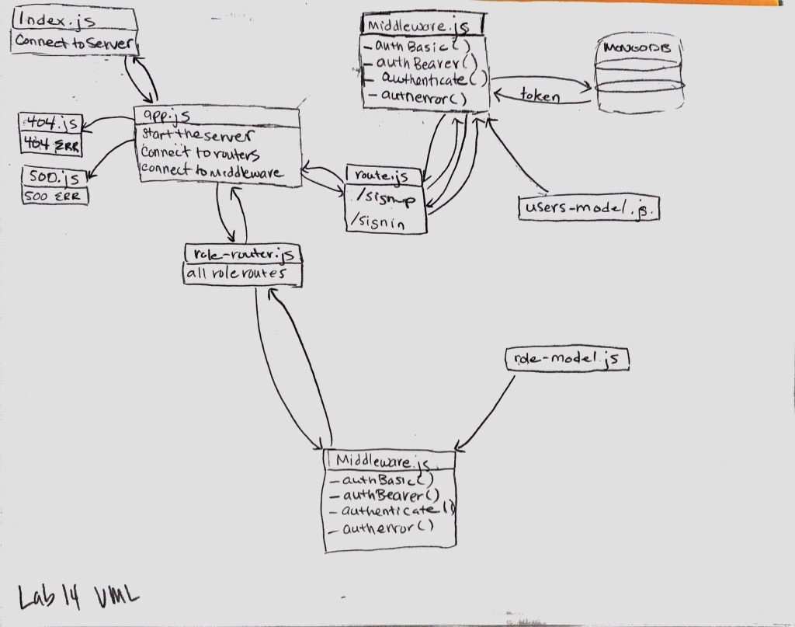

 LAB
=================================================

## Access Control (ACL)

### Author: Erin Trainor

### Links and Resources
* [repo](https://github.com/401-advanced-javascript-401d29/lab-14/pull/1)
* [travis](https://www.travis-ci.com/401-advanced-javascript-401d29/lab-14)
* [back-end](https://stormy-hollows-76214.herokuapp.com) (when applicable)

#### Documentation
* [jsdoc](https://stormy-hollows-76214.herokuapp.com/docs)

### Setup
#### `.env` requirements
* `PORT` - 3000
* `MONGODB_URI` - MONGODB_URI=MONGODB_URI=mongodb://localhost:27017/users
* `SECRET` - Puppy

#### Running the app
* To run Mongo
  * Open 3 terminal tabs
    * First tab
      * mongod --dbpath=/Users/erintrainor/codefellows/data/db (substitute your file path)
      * Second tab
        * mongo
      * Third tab
        * nodemon
  
#### Terminal commands to manipulate databaes
* Add a role
  * echo '{"role":"superuser", "capabilities":["create","read","update","delete", "superuser"]}' | http :3000/roles
  * echo '{"role":"admin", "capabilities":["create","read","update","delete"]}' | http :3000/roles
  * echo '{"role":"editor", "capabilities":["create", "read", "update"]}' | http :3000/roles
  * echo '{"role":"user", "capabilities":["read"]}' | http :3000/roles
* Add a User
  * echo '{"username":"michelangelo", "password":"michelangelo", "role":"superuser"}' | http post :3000/signup
  * echo '{"username":"leonardo", "password":"leonardo", "role":"admin"}' | http post :3000/signup
  * echo '{"username":"donatello", "password":"donatello", "role":"editor"}' | http post :3000/signup
  * echo '{"username":"raphael", "password":"raphael", "role":"user"}' | http post :3000/signup
* Sign-In
  * http post :3000/signin -a michelangelo:michelangelo
  * http post :3000/signin -a leonardo:leonardo
  * http post :3000/signin -a donatello:donatello
  * http post :3000/signin -a raphael:raphael
* Check if a user is authorized (after signing-in) - The user that is currently signed in will determine the messages sent
  * http get :3000/public-stuff "Authorization: Bearer ${access_token}"
  * http get :3000/hidden-stuff "Authorization: Bearer ${access_token}"
  * http get :3000/something-to-read "Authorization: Bearer ${access_token}"
  * http post :3000/create-a-thing "Authorization: Bearer ${access_token}"
  * http put :3000/update "Authorization: Bearer ${access_token}"
  * http patch :3000/jp "Authorization: Bearer ${access_token}"
  * http delete :3000/bye-bye "Authorization: Bearer ${access_token}"
  * http get :3000/everything "Authorization: Bearer ${access_token}"
#### Tests
* How do you run tests?
  * npm run test
* What assertions were made?
  * Only what is part of the sample code
* What assertions need to be / should be made?
  * additional things

#### UML

